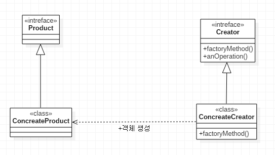
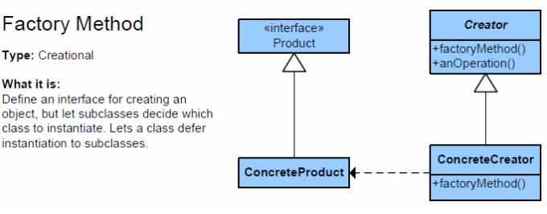
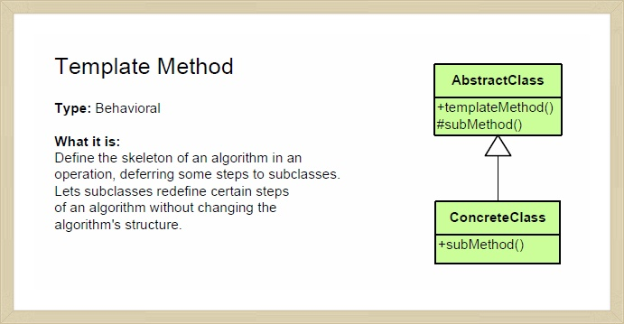
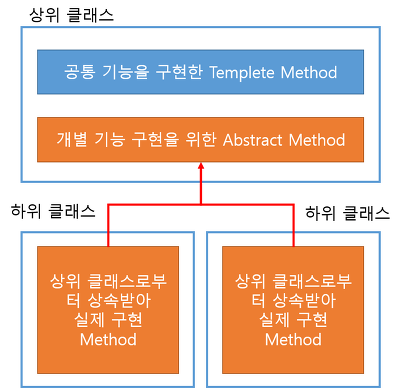

# design_pattern
Java 코드로 작성하는 나의 디자인 패턴  
한번 복습겸, 사용해본 패턴에 대해서 정리 및 예제를 작성하고 싶어서 시작한 프로젝트.  
팩토리 메서드 패턴은 기성총회 프로젝트(HFIN) 출력물 컴포넌트를 만들때..  
템플릿 메서드 패턴은 종교인과세계산기 프로젝트(CTX) 계산기만들때.. 

---
**UML**
---

---

## factory method pattern
- Type : Creational
- 객체를 생성하는 일을 서브클래스에 위임. (공장이라는 단어에서 보듯이, 공장에서 객체를 생성해서 return 해준다)
- 매개변수를 사용해서, 매개변수를 바탕으로 한 가지 이상의 객체를 생성할 수 있으며, 매개변수 사용하지 않고 그냥 한가지의 객체만 생성할 수도 있다.
- 객체를 생성하는 역할을 분리하여, 결합도(coupling)를 낮춘다. 결합도가 낮아지면 다른 클래스에게 영향을 덜 준다고 생각하면 된다. 객체 생성 코드를 전부 한 객체 또는 메소드에 집어넣으면 코드에 중복되는 내용을 제거할 수 있고, 나중에 관리할 때도 한군데에만 신경을 쓰면 된다. 그리고 클라이언트 입장에서는 객체 인스턴스를 만들 때 필요한 구상 클래스가 아닌 인터페이스만 필요로 하게 된다
- 단점으로는, 생성을 해야할 객체종류가 많아지면 concrete factory 클래스의 개수도 늘어나므로 설계가 복잡해 질수 있으며, 새로운 제품이 추가될 경우, 모든 concrete factory 를 수정해야한다.

---
**UML**
---

---

## template method pattern
- Type : Behavioral
- 상위클래스에서 처리의 흐름을 제어하며, 하위클래스에서 처리의 내용을 구체화.
- 여러 클래스에 공통되는 사항은 상위클래스에서 구현. 각각의 상세부분은 하위클래스에서 구현한다.(공통되는 부분을 빼면, 중복코드가 줄겠죠?)
- 세부적인 부분은 하위클래스에서 작성을 하니, 만약 뭔가 변경이 되면 그부분만 수정하면 되니 유지보수와 리팩토링할때 유리하다.
- 템플릿 메서드 패턴은 알고리즘의 뼈대를 맞추는것이 모토. 즉, 전체적인 레이아웃을 통일시키면서 상속받은 하위클래스로 하여금 어느정도 유연성을 주도록 한다.
- 단점으로는 상속을 통하여 구현이 되므로, 해당 추상 메소드가 필요한 클래스마다 상속을 받아야 한다는 점(abstact method가 너무 많으면 관리가 곤란)
- 종교인과세 계산기 프로젝트 할때, 사용 이유는 확장성과 유지보수성 때문에 선택(내가 처음에 생각했던 방법은 각각의 서비스에서 메소드가 2짝식 존재하는 방식이었음)

